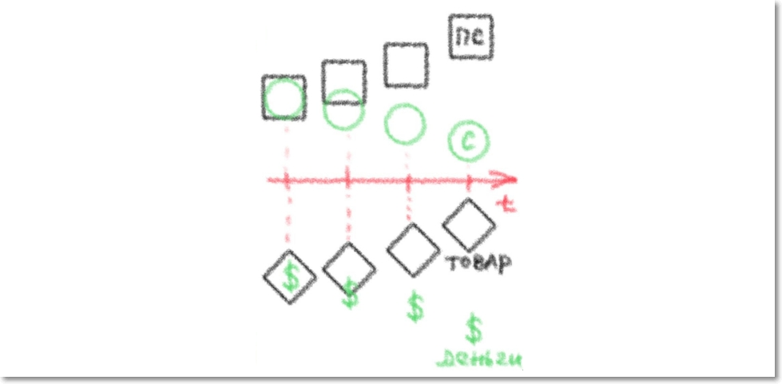

## Глава 2
(Цитаты не точные! Частично изменены для читабельности)

> "Чтобы вещи могли относиться друг к другу как товары, их владельцы должны относиться друг к другу как лица, воля которых распоряжается этими вещами: один товаровладелец лишь по воле другого может присвоить себе его товар"[^1]

> "Частная собственность (на товар) - это волевое отношение, в котором отражается экономическое отношение"[^2]

> "Экономические маски лиц - это только олицетворение экономических отношений."[^3]

> "Отношения частной собственности на товары это такие отношения, в которых владельцы товаров **существуют друг для друга** **лишь как представители товаров**."

> "Вся потребительная стоимость товара для его владельца заключается лишь в том, что он есть носитель меновой стоимости, что он **средство обмена** на другой товар."

> "Все товары суть `непотребительные` стоимости для своих владельцев и `потребительные` стоимости для своих невладельцев"[^6]

> ""[^7]

>"является ли труд действительно полезным для других, удовлетворяет ли его продукт какой-либо чужой потребности, — это может доказать лишь обмен"[^8]

>"В той же самой мере, в какой продукт труда превращается в товары, происходит и превращение товара в деньги"[^9]

Пояснение: по сути просиходит вытеснение одного единственного товара в качестве всеобщего эквивалента.

>"Денежный кристалл есть необходимый продукт процесса обмена, в котором разнородные продукты труда фактически приравниваются друг к другу и тем самым фактически превращаются в товары. Исторический процесс расширения и углубления обмена развивает дремлющую в товарной природе противоположность между потребительной стоимостью и стоимостью. Потребность дать для оборота внешнее выражение этой противоположности ведет к возникновению самостоятельной формы товарной стоимости и не дает покоя до тех пор, пока задача эта не решается окончательно путем раздвоения товара на товар и деньги. 
> Следовательно, в той же мере, в какой продукт труда превращается в товар, некоторый особенный товар сам превращается в деньги."[^10]

>""[^11]

>""[^12]

>""[^13]

>""[^14]

>""[^16]

>""[^15]

>""[^17]

>""[^18]

>""[^19]

[^6]:[стр. 92](https://www.esperanto.mv.ru/Marksismo/Kapital1/kapital1-02html#c2:~:text=%D0%92%D1%81%D0%B5%20%D1%82%D0%BE%D0%B2%D0%B0%D1%80%D1%8B%20%D1%81%D1%83%D1%82%D1%8C%20%D0%BD%D0%B5%D0%BF%D0%BE%D1%82%D1%80%D0%B5%D0%B1%D0%B8%D1%82%D0%B5%D0%BB%D1%8C%D0%BD%D1%8B%D0%B5%20%D1%81%D1%82%D0%BE%D0%B8%D0%BC%D0%BE%D1%81%D1%82%D0%B8%20%D0%B4%D0%BB%D1%8F%20%D1%81%D0%B2%D0%BE%D0%B8%D1%85%20%D0%B2%D0%BB%D0%B0%D0%B4%D0%B5%D0%BB%D1%8C%D1%86%D0%B5%D0%B2%20%D0%B8%20%D0%BF%D0%BE%D1%82%D1%80%D0%B5%D0%B1%D0%B8%D1%82%D0%B5%D0%BB%D1%8C%D0%BD%D1%8B%D0%B5%20%D1%81%D1%82%D0%BE%D0%B8%D0%BC%D0%BE%D1%81%D1%82%D0%B8%20%D0%B4%D0%BB%D1%8F%20%D1%81%D0%B2%D0%BE%D0%B8%D1%85%20%D0%BD%D0%B5%D0%B2%D0%BB%D0%B0%D0%B4%D0%B5%D0%BB%D1%8C%D1%86%D0%B5%D0%B2)

[^7]:

[^8]:[(По изд. 1952 г.) стр. 92](https://www.esperanto.mv.ru/Marksismo/Kapital1/kapital1-02.html#c2:~:text=%D1%8F%D0%B2%D0%BB%D1%8F%D0%B5%D1%82%D1%81%D1%8F%20%D0%BB%D0%B8%20%D1%82%D1%80%D1%83%D0%B4%20%D0%B4%D0%B5%D0%B9%D1%81%D1%82%D0%B2%D0%B8%D1%82%D0%B5%D0%BB%D1%8C%D0%BD%D0%BE%20%D0%BF%D0%BE%D0%BB%D0%B5%D0%B7%D0%BD%D1%8B%D0%BC%20%D0%B4%D0%BB%D1%8F%20%D0%B4%D1%80%D1%83%D0%B3%D0%B8%D1%85%2C%20%D1%83%D0%B4%D0%BE%D0%B2%D0%BB%D0%B5%D1%82%D0%B2%D0%BE%D1%80%D1%8F%D0%B5%D1%82%20%D0%BB%D0%B8%20%D0%B5%D0%B3%D0%BE%20%D0%BF%D1%80%D0%BE%D0%B4%D1%83%D0%BA%D1%82%20%D0%BA%D0%B0%D0%BA%D0%BE%D0%B9%2D%D0%BB%D0%B8%D0%B1%D0%BE%20%D1%87%D1%83%D0%B6%D0%BE%D0%B9%20%D0%BF%D0%BE%D1%82%D1%80%D0%B5%D0%B1%D0%BD%D0%BE%D1%81%D1%82%D0%B8%2C%20%E2%80%94%20%D1%8D%D1%82%D0%BE%20%D0%BC%D0%BE%D0%B6%D0%B5%D1%82%20%D0%B4%D0%BE%D0%BA%D0%B0%D0%B7%D0%B0%D1%82%D1%8C%20%D0%BB%D0%B8%D1%88%D1%8C%20%D0%BE%D0%B1%D0%BC%D0%B5%D0%BD)

[^9]:[ стр. 94]()

[^10]:[стр. 93](https://www.esperanto.mv.ru/Marksismo/Kapital1/kapital1-02.html#c2:~:text=%D0%BF%D1%80%D0%B8%D1%80%D0%B0%D0%B2%D0%BD%D0%B8%D0%B2%D0%B0%D1%8E%D1%82%D1%81%D1%8F%20%D0%B4%D1%80%D1%83%D0%B3%20%D0%BA%20%D0%B4%D1%80%D1%83%D0%B3%D1%83%20%D0%B8%20%D1%82%D0%B5%D0%BC%20%D1%81%D0%B0%D0%BC%D1%8B%D0%BC%20%D1%84%D0%B0%D0%BA%D1%82%D0%B8%D1%87%D0%B5%D1%81%D0%BA%D0%B8%20%D0%BF%D1%80%D0%B5%D0%B2%D1%80%D0%B0%D1%89%D0%B0%D1%8E%D1%82%D1%81%D1%8F%20%D0%B2%20%D1%82%D0%BE%D0%B2%D0%B0%D1%80%D1%8B.)

[^11]:

[^12]:

[^13]:

[^14]:

[^16]:

[^15]:

[^17]:

[^18]:

[^19]: