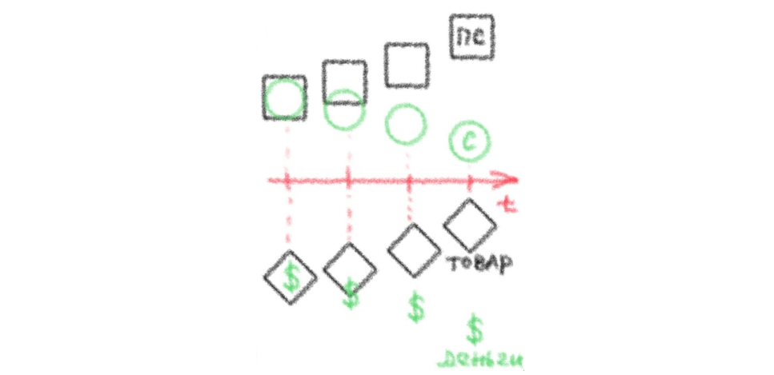

## Глава 2

### Схема цитирования: 

цитаты здесь частично перефразированы мною для большей понятности, в примечаниях страницы даны по изданию 1953 года, ссылки же открываются в электронной версии на сайте https://www.esperanto.mv.ru/. Получается три различных варианта одной и той же мысли.

> "Чтобы вещи могли относиться друг к другу как товары, их владельцы должны относиться друг к другу как лица, воля которых распоряжается этими вещами: один товаровладелец лишь по воле другого может присвоить себе его товар"[^1]

> "Частная собственность (на товар) - это волевое отношение, в котором отражается экономическое отношение"[^2]

> "Экономические маски лиц - это только олицетворение экономических отношений."[^3]

> "Отношения частной собственности на товары это такие отношения, в которых владельцы товаров **существуют друг для друга** **лишь как представители товаров**."

> "Вся потребительная стоимость товара для его владельца заключается лишь в том, что он есть носитель меновой стоимости, что он **средство обмена** на другой товар."

> "Все товары суть `непотребительные` стоимости для своих владельцев и `потребительные` стоимости для своих невладельцев"[^6]

> "товары должны реализоваться как стоимости, `прежде` чем они получат возможность реализоваться как потребительные стоимости"[^7]

>"прежде чем товары смогут реализоваться как стоимости, они должны доказать наличие своей потребительной стоимости... Но лишь обмен может фактически показать, оказывается ли труд действительно полезным для других"[^8]

>"обмен представляет для владельца товара чисто индивидуальный процесс. С другой стороны, он хочет реализовать свой товар как стоимость - то есть в любом другом товаре той же стоимости... Постольку обмен представляет для товаровладельца всеобщий и общественный процесс. Но один и тот же процесс не может быть одновременно для всех товаровладельцев только индивидуальным и только всеобщим."[^9]

>"...собственный товар товаровладельца играет для него роль всеобщего эквивалента всех других товаров. Но так как в этом сходятся все товаровладельцы, то ни один товар фактически не является всеобщим эквивалентом, а потому товары не обладают и всеобщей относительной формой стоимости (ВОФС)... они противостоят друг другу вообще не как товары, а только как продукты, как потребительные стоимости"[^10]

>"Только общественное действие может превратить определенный товар во всеобщий эквивалент. Поэтому общественное действие всех прочих товаров исторгает из их среды один определенный товар, в котором все они выражают свои стоимости... Последний делается деньгами."[^11]

>"Денежный кристалл есть необходимый продукт процесса обмена, в котором разнородные продукты труда фактически приравниваются друг к другу и тем самым фактически превращаются в товары. Исторический процесс расширения и углубления обмена развивает дремлющую в товарной природе противоположность между потребительной стоимостью и стоимостью. Потребность дать для оборота внешнее выражение этой противоположности ведет к возникновению самостоятельной формы товарной стоимости и не дает покоя до тех пор, пока задача эта не решается окончательно путем раздвоения товара на товар и деньги. 
> Следовательно, в той же мере, в какой продукт труда превращается в товар, некоторый особенный товар сам превращается в деньги."[^12]

Пояснение: по сути просиходит вытеснение одного единственного товара в качестве всеобщего эквивалента.

>"Первая предпосылка чтобы предмет потребления стал потенциальной меновой стоимостью сводится к тому, что данный предмет потребления утрачивает свою потребительную стоимость, имеется в количестве, превышающем непосрдественные потребности своего владельца... Вещи отчуждаемы, но чтобы это отчуждение стало взаимным люди должны относиться друг к другу ... как к независимым друг от друга личностям."[^13]

>"Отношение взаимной отчужденности не существует между членами естественно выросшей общины... Обмен товаров начинается там, где кончается община, в пунктах её соприкосновения с чужими общинами или членами чужих общин."[^14]

>"...Количественное отношение, в котором обмениваются вещи, делается зависимым от самого их производства. Обычай фиксирует такие количественные отношения как величины стоимости."[^15]

>"Что 'золото и серебро про природе своей не деньги, но деньги по своей природе золото и серебро', доказывается согласованностью ествественных свойств этих металлов с их общественными функциями."[^16]

>"Потребительная стоимость денежного товара раздваивается... он получает формальную потребительную стоимость, вытекающую из его специфически общественных функций."[^17]

>"Форма денег есть лишь застывший на данном товаре отблеск отношений к нему всех остальных товаров."[^18]

>"Процесс обмена дает товару, который он превращает в деньги, не его стоимсоть, а лишь его специфическую форму стоимости."[^19]

>"денежная форма вещей есть нечто постороннее для них самих... она только форма проявления скртыых за ними человеческих отношений"[^20]

>"Его (золота) собственная стоимость определяется рабочим временем, требующимся для его производства, и выражается в том количестве всякого иного товара, в каком кристаллизовалос столько же рабочего времени."[^21]

>"Трудность состоит не в том, чтобы понять, что деньги - товар, а в том, чтобы выяснить, как и почему товар становится деньгами."[^22]

>"создается впечатление, будто не данный товар становится деньгами только потому, что в нем выражают свои стоимсоти все другие товары, а, наоборот, будто бы эти послдение выражают в нем свои стоимости потому, что он - деньги. Посредствующее движение исчезает в своём собственном результате без следа."[^23]

>"В капитализме отношения людей в общественном процессе произвоства чисто атомистические. Из-за этого их производственнные отношения принимают вещный характер, независимый от их контроля и сознательной индивидуальной деятельности. Это проявляется в том, что продукты их труда вообще принимают форму товаров....загадка денежного фетиша есть загадка товарного фетиша вообще; в деньгах она лишь сильнее бросается в глаза и слепит взор."[^24]

>""[^25]

[^6]:[стр. 92](https://www.esperanto.mv.ru/Marksismo/Kapital1/kapital1-02html#c2:~:text=%D0%92%D1%81%D0%B5%20%D1%82%D0%BE%D0%B2%D0%B0%D1%80%D1%8B%20%D1%81%D1%83%D1%82%D1%8C%20%D0%BD%D0%B5%D0%BF%D0%BE%D1%82%D1%80%D0%B5%D0%B1%D0%B8%D1%82%D0%B5%D0%BB%D1%8C%D0%BD%D1%8B%D0%B5%20%D1%81%D1%82%D0%BE%D0%B8%D0%BC%D0%BE%D1%81%D1%82%D0%B8%20%D0%B4%D0%BB%D1%8F%20%D1%81%D0%B2%D0%BE%D0%B8%D1%85%20%D0%B2%D0%BB%D0%B0%D0%B4%D0%B5%D0%BB%D1%8C%D1%86%D0%B5%D0%B2%20%D0%B8%20%D0%BF%D0%BE%D1%82%D1%80%D0%B5%D0%B1%D0%B8%D1%82%D0%B5%D0%BB%D1%8C%D0%BD%D1%8B%D0%B5%20%D1%81%D1%82%D0%BE%D0%B8%D0%BC%D0%BE%D1%81%D1%82%D0%B8%20%D0%B4%D0%BB%D1%8F%20%D1%81%D0%B2%D0%BE%D0%B8%D1%85%20%D0%BD%D0%B5%D0%B2%D0%BB%D0%B0%D0%B4%D0%B5%D0%BB%D1%8C%D1%86%D0%B5%D0%B2)

[^7]:

[^8]:[ стр. 92](https://www.esperanto.mv.ru/Marksismo/Kapital1/kapital1-02.html#c2:~:text=%D1%8F%D0%B2%D0%BB%D1%8F%D0%B5%D1%82%D1%81%D1%8F%20%D0%BB%D0%B8%20%D1%82%D1%80%D1%83%D0%B4%20%D0%B4%D0%B5%D0%B9%D1%81%D1%82%D0%B2%D0%B8%D1%82%D0%B5%D0%BB%D1%8C%D0%BD%D0%BE%20%D0%BF%D0%BE%D0%BB%D0%B5%D0%B7%D0%BD%D1%8B%D0%BC%20%D0%B4%D0%BB%D1%8F%20%D0%B4%D1%80%D1%83%D0%B3%D0%B8%D1%85%2C%20%D1%83%D0%B4%D0%BE%D0%B2%D0%BB%D0%B5%D1%82%D0%B2%D0%BE%D1%80%D1%8F%D0%B5%D1%82%20%D0%BB%D0%B8%20%D0%B5%D0%B3%D0%BE%20%D0%BF%D1%80%D0%BE%D0%B4%D1%83%D0%BA%D1%82%20%D0%BA%D0%B0%D0%BA%D0%BE%D0%B9%2D%D0%BB%D0%B8%D0%B1%D0%BE%20%D1%87%D1%83%D0%B6%D0%BE%D0%B9%20%D0%BF%D0%BE%D1%82%D1%80%D0%B5%D0%B1%D0%BD%D0%BE%D1%81%D1%82%D0%B8%2C%20%E2%80%94%20%D1%8D%D1%82%D0%BE%20%D0%BC%D0%BE%D0%B6%D0%B5%D1%82%20%D0%B4%D0%BE%D0%BA%D0%B0%D0%B7%D0%B0%D1%82%D1%8C%20%D0%BB%D0%B8%D1%88%D1%8C%20%D0%BE%D0%B1%D0%BC%D0%B5%D0%BD)

[^9]:[ стр. 93]()

[^10]:[ стр. 93]()

[^11]:[ стр. 93]()

[^12]:[ стр. 94]()

[^13]:[ стр. 94]()

[^14]:[ стр. 94]()

[^15]:[ стр. 95]()

[^16]:[ стр. 96]()

[^17]:[ стр. 97]()

[^18]:[ стр. 97]()

[^19]:[ стр. 97]()

[^20]:[ стр. 97]()

[^21]:[ стр. 98]()

[^22]:[ стр. 99]()

[^23]:[ стр. 99]()

[^24]:[ стр. 100]()